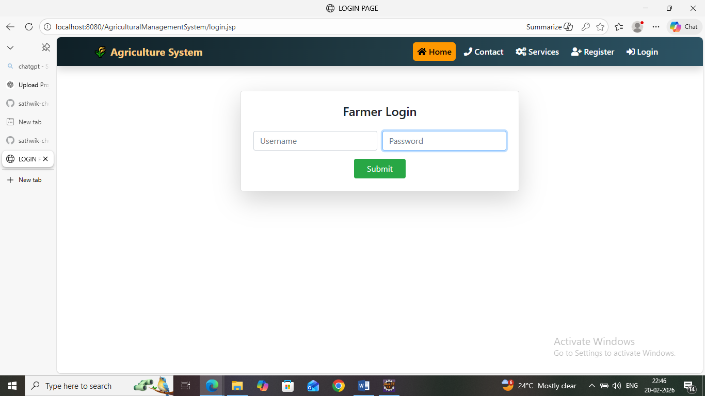
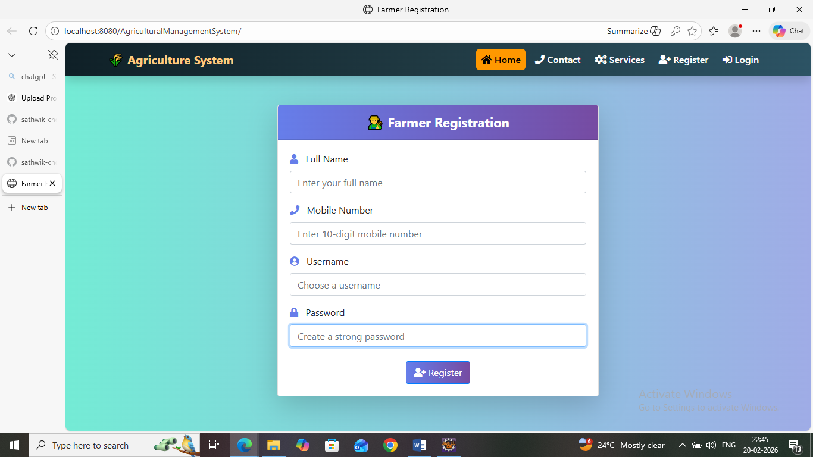
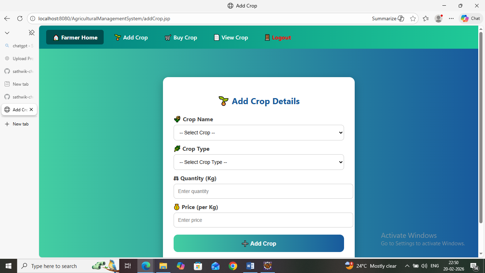
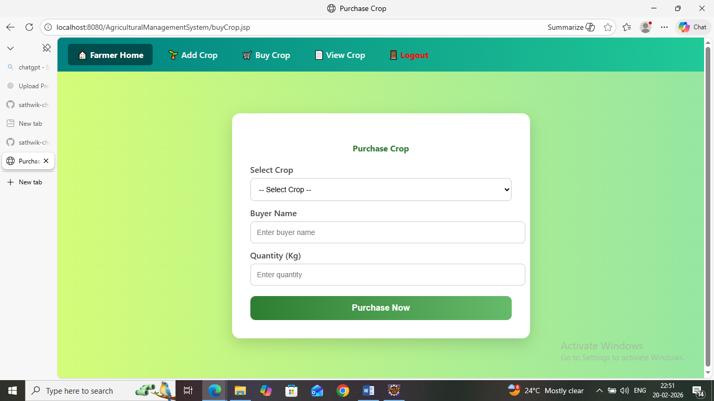
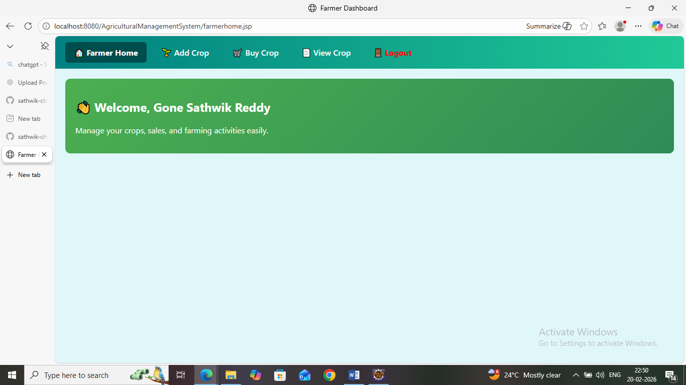
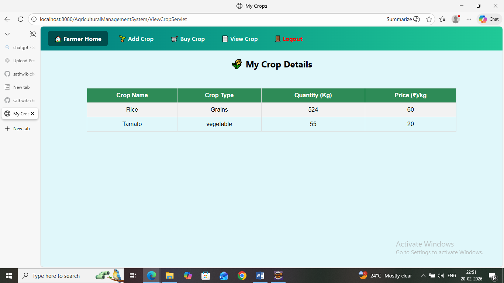

# 🌾 Agricultural Management System

A Maven-based Java Web Application developed using **JSP and Servlets** following the **MVC Architecture Pattern**.

This system helps manage agricultural operations such as farmer registration, crop management, crop purchasing, and record maintenance through a web interface.

---

## 🛠 Tech Stack

### Frontend (View Layer)
- JSP
- HTML
- CSS
- JavaScript

### Backend (Controller Layer)
- Java Servlets
- MVC Architecture

### Database
- MySQL

### Build Tool
- Maven

### Server
- Apache Tomcat

### IDE
- Eclipse / IntelliJ IDEA

---

## 🏗 Architecture (MVC Pattern)

```
Browser
   ↓
JSP Pages (View Layer)
   ↓
Servlet Controllers
   ↓
DAO Layer
   ↓
MySQL Database
```

---

## 📂 Project Structure

```
agricultural-management-system/
│
├── src/main/java/com/
│   ├── controller/
│   ├── dao/
│   ├── model/
│   └── vcube/utility/
│
├── src/main/webapp/
│   ├── META-INF/
│   ├── WEB-INF/
│   ├── index.jsp
│   ├── login.jsp
│   ├── farmerregister.jsp
│   ├── addCrop.jsp
│   ├── buyCrop.jsp
│   ├── farmerhome.jsp
│   ├── viewCrop.jsp
│   └── services.jsp
│
├── Screenshots/
└── README.md
```

---

## ✨ Features

- 👨‍🌾 Farmer Registration
- 🔐 Login System
- 🌱 Add Crop
- 🛒 Buy Crop
- 📋 View Crop Details
- MVC-Based Clean Architecture
- JDBC Database Connectivity

---

## 🚀 How to Run the Project

### 1️⃣ Clone the Repository

```bash
git clone https://github.com/sathwik-chotu/agricultural-management-system.git
```

---

### 2️⃣ Import into IDE

- Open Eclipse or IntelliJ IDEA
- Import as Maven Project

---

### 3️⃣ Configure Database

Create database:

```sql
CREATE DATABASE agriculture_db;
```

Update database credentials inside your DAO/utility classes.

---

### 4️⃣ Configure Apache Tomcat

- Add Tomcat Server in IDE
- Deploy this project
- Start the server

Open in browser:

```
http://localhost:8080/agricultural-management-system
```

---

## 📸 Screenshots

### 🔐 Login Page


---

### 📝 Farmer Registration Page


---

### 🌱 Add Crop Page


---

### 🛒 Buy Crop Page


---

### 👨‍🌾 Farmer Home Page


---

### 📋 View Crop Page


---

## 📌 Future Enhancements

- Role-Based Authentication (Admin/Farmer)
- Spring Boot Upgrade
- REST API Integration
- Cloud Deployment (AWS / Azure)
- Responsive UI Improvement

---

## 👨‍💻 Developer

**Sathwik Reddy**  
GitHub: https://github.com/sathwik-chotu  

---

⭐ If you found this project useful, give it a star!